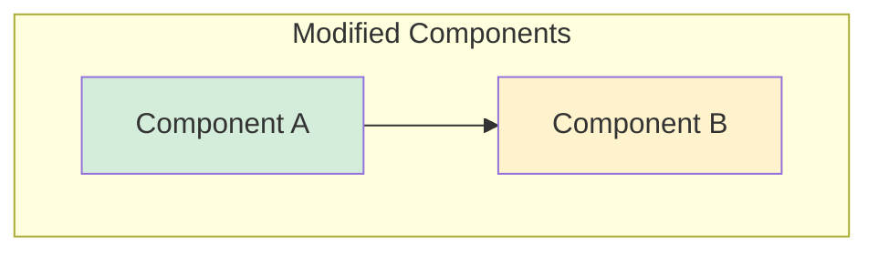

# Head Agent Initialization

> **Purpose**: Set up this session as a workflow head agent that analyzes a request locally, writes a local plan for operator convenience, embeds the relevant plan content into spawned prompts, tracks task progress, and reports results without requiring a runtime refactor.

## Use Cases

1. **Coding Delegation**: User describes a feature, head agent plans locally and delegates implementation to a coding agent
2. **Parallel Development**: Spawn multiple coding agents for separate tasks
3. **Review Workflow**: Plan implementation, delegate execution, and summarize outcomes

## Quick Start

After loading this skill, operate as a **workflow head agent**. When the user requests a coding task:

1. **Analyze** the request and search the codebase
2. **Plan** the implementation and save it locally in `.claude/plans/{task-slug}.md`
3. **Delegate** by embedding the relevant plan content into `devsh orchestrate spawn`
4. **Track** progress with `status` or `wait`, then report results with a concise summary

## Workflow

### Step 1: Receive Task
User describes what they want built, fixed, or changed.

### Step 2: Analyze and Plan Locally
Keep a local plan file for your own workflow and review process.

```markdown
# Task: [Title]

## TL;DR
- Brief summary of what needs to be done

## Files to Modify
- `path/to/file1.ts` - Description of changes
- `path/to/file2.ts` - Description of changes

## Implementation Steps
1. Step one details
2. Step two details
3. Step three details

## Tests Required
- [ ] Test case 1
- [ ] Test case 2

## Acceptance Criteria
- Criterion 1
- Criterion 2
```

### Step 3: Delegate with Inline Plan Content
The spawned worker should receive the plan content in the prompt. Do not rely on the worker being able to read your local `.claude/plans/*.md` path.

Use `/execute-plan` for the standard operator flow, or follow the canonical portable prompt pattern documented in `/devsh-orchestrator`.

For large plans, inline only the relevant excerpt or a tight summary instead of pasting the entire file into one command argument.

### Step 4: Track and Report
```bash
# Monitor progress for the spawned orchestration task
# Use the Orchestration Task ID printed by spawn
devsh orchestrate status <orch-task-id> --watch

# Or wait for completion
devsh orchestrate wait <orch-task-id>

# Aggregated orchestration results require an orchestration session ID
# Use this only with flows that create one, such as cloud head-agent runs or migrate-backed workflows
devsh orchestrate results <orchestration-id>
```

## Configuration

Set preferred coding agent via environment variable:
```bash
export CMUX_CODING_AGENT=codex/gpt-5.4-xhigh       # High-powered Codex
export CMUX_CODING_AGENT=codex/gpt-5.1-codex-mini  # Default Codex
export CMUX_CODING_AGENT=claude/sonnet-4.5         # Claude Sonnet
export CMUX_CODING_AGENT=claude/haiku-4.5          # Fast Claude
```

## Result Summary Format

When the coding agent completes, report to the user with this structure:

````markdown
## Execution Summary

### What was done
- Bullet points of changes made

### Changes Flowchart


### Files Changed
- `path/file1.ts` - NEW/MODIFIED: description
- `path/file2.ts` - MODIFIED: description

### Test Results
- Tests: PASS/FAIL

### PR
- Link to created PR (include only when this workflow actually created one)
````

## Notes

- This skill provides **workflow scaffolding** for planning, delegation, and reporting.
- The default portable workflow is: local planning + inline prompt delegation + task-level tracking.
- Stronger orchestration-session flows such as `--cloud-workspace` and `devsh orchestrate migrate` are advanced options, not the default path for a small workflow-skills change.

## Related Skills

- `/execute-plan` - Execute a saved plan by embedding it into a spawned prompt
- `/track-agent` - Track a specific orchestration task
- `/devsh-orchestrator` - Full orchestration command reference
