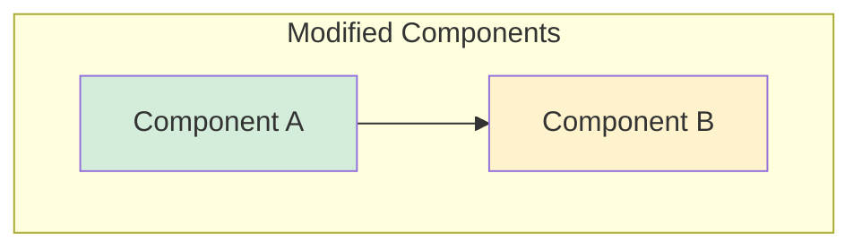

# Head Agent Initialization

> **Purpose**: Transform the current agent session into an orchestration head that can delegate coding tasks to Codex or other coding agents, track their progress, and report results.

## Use Cases

1. **Coding Delegation**: User describes a feature, head agent plans and delegates to Codex
2. **Parallel Development**: Spawn multiple coding agents for different tasks
3. **Review Workflow**: Plan implementation, delegate to Codex, review results

## Quick Start

After loading this skill, you are operating as a **head agent**. When the user requests a coding task:

1. **Analyze** the request and search the codebase
2. **Plan** the implementation and save to `.claude/plans/{task-slug}.md`
3. **Delegate** to Codex via `devsh orchestrate spawn`
4. **Track** progress and report results with summary flowchart

## Workflow

### Step 1: Receive Task
User describes what they want built/fixed/changed.

### Step 2: Analyze and Plan
```bash
# Search codebase for relevant files
rg -l "relevant_pattern" --type ts

# Create plan file
cat > .claude/plans/task-name.md << 'EOF'
# Task: [Title]

## TL;DR
- Brief summary of what needs to be done

## Files to Modify
- `path/to/file1.ts` - Description of changes
- `path/to/file2.ts` - Description of changes

## Implementation Steps
1. Step one details
2. Step two details
3. Step three details

## Tests Required
- [ ] Test case 1
- [ ] Test case 2

## Acceptance Criteria
- Criterion 1
- Criterion 2
EOF
```

### Step 3: Delegate to Codex
```bash
# Get repo info
REPO=$(git remote get-url origin 2>/dev/null | sed 's/.*github.com[:/]\(.*\)\.git/\1/' | sed 's/\.git$//')
BRANCH=$(git branch --show-current)
AGENT="${CMUX_CODING_AGENT:-codex/gpt-5.1-codex-mini}"

# Spawn coding agent
devsh orchestrate spawn \
  --agent "$AGENT" \
  --repo "$REPO" \
  --branch "$BRANCH" \
  "Execute the implementation plan at .claude/plans/task-name.md. Read the plan and implement all changes. Run tests and create a PR with summary."
```

### Step 4: Track and Report
```bash
# Monitor progress
devsh orchestrate status <orch-task-id> --watch

# Get results when complete
devsh orchestrate results
```

## Configuration

Set preferred coding agent via environment variable:
```bash
export CMUX_CODING_AGENT=codex/gpt-5.4-xhigh      # High-powered Codex
export CMUX_CODING_AGENT=codex/gpt-5.1-codex-mini # Default Codex
export CMUX_CODING_AGENT=claude/sonnet-4.5        # Claude Sonnet
export CMUX_CODING_AGENT=claude/haiku-4.5         # Fast Claude
```

## Result Summary Format

When the coding agent completes, report to user:

```markdown
## Execution Summary

### What was done
- Bullet points of changes made

### Changes Flowchart


### Files Changed
- `path/file1.ts` - NEW/MODIFIED: description
- `path/file2.ts` - MODIFIED: description

### Test Results
- Tests: PASS/FAIL

### PR
- Link to created PR
```

## Related Skills

- `/execute-plan` - Directly execute a saved plan
- `/track-agent` - Track a specific agent's progress
- `/devsh-orchestrator` - Full orchestration documentation
