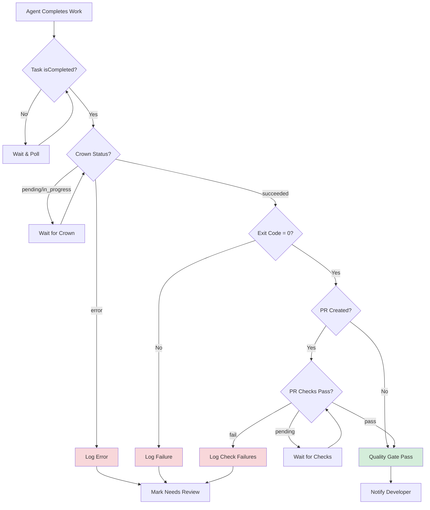

# head-agent - GitHub Projects Polling Loop

> **Purpose**: Run a background loop that polls GitHub Projects for items in "Backlog" (or a configurable status) that don't have linked tasks, then automatically dispatches agents to work on them. Enables fully autonomous development workflows driven by project boards.

## Use Cases

1. **Continuous Development**: Automatically pick up backlog items and start working on them
2. **Team Automation**: Keep development moving without manual task dispatch
3. **Board-Driven Development**: Let the project board drive what work gets done
4. **Scheduled Processing**: Process backlog items at regular intervals

## Quick Start

```bash
# Start a head agent polling loop (polls every 5 minutes by default)
devsh head-agent start \
  --project-id PVT_xxx \
  --installation-id 12345 \
  --repo owner/repo \
  --agent claude/haiku-4.5

# Poll once and dispatch (no loop)
devsh head-agent poll-once \
  --project-id PVT_xxx \
  --installation-id 12345 \
  --repo owner/repo \
  --agent claude/haiku-4.5

# Check items that would be dispatched (dry run)
devsh project items \
  --project-id PVT_xxx \
  --installation-id 12345 \
  --status Backlog \
  --no-linked-task
```

## Architecture

```
                    GitHub Project (v2)
                           |
                           v
+--------------------------------------------------+
|               Head Agent Polling Loop             |
|                                                   |
|  1. Poll: devsh project items                     |
|           --status Backlog --no-linked-task       |
|                                                   |
|  2. For each new item:                            |
|     devsh task create --from-project-item PVTI_   |
|                       --agent <configured-agent>  |
|                                                   |
|  3. Sleep for poll interval                       |
|                                                   |
|  4. Repeat                                        |
+--------------------------------------------------+
                           |
                           v
               +---------------------+
               |  Spawned Agents     |
               |  (in sandboxes)     |
               +---------------------+
                           |
                           v
               +---------------------+
               |  GitHub PRs         |
               |  (auto-created)     |
               +---------------------+
```

## Shell Script Implementation

You can implement a head agent polling loop using a simple shell script:

```bash
#!/usr/bin/env bash
# head-agent-loop.sh - Polls GitHub Project and dispatches agents for new backlog items
set -euo pipefail

# Configuration
PROJECT_ID="${HEAD_AGENT_PROJECT_ID:-}"
INSTALLATION_ID="${HEAD_AGENT_INSTALLATION_ID:-}"
REPO="${HEAD_AGENT_REPO:-}"
AGENT="${HEAD_AGENT_AGENT:-claude/haiku-4.5}"
POLL_INTERVAL="${HEAD_AGENT_POLL_INTERVAL:-300}"  # 5 minutes default
STATUS="${HEAD_AGENT_STATUS:-Backlog}"
MAX_ITEMS_PER_POLL="${HEAD_AGENT_MAX_ITEMS:-5}"
LOG_FILE="${HEAD_AGENT_LOG_FILE:-/tmp/head-agent.log}"

# Validate configuration
if [[ -z "$PROJECT_ID" || -z "$INSTALLATION_ID" || -z "$REPO" ]]; then
  echo "ERROR: Missing required configuration"
  echo "Set HEAD_AGENT_PROJECT_ID, HEAD_AGENT_INSTALLATION_ID, HEAD_AGENT_REPO"
  exit 1
fi

log() {
  echo "[$(date -Iseconds)] $*" | tee -a "$LOG_FILE"
}

poll_and_dispatch() {
  log "Polling project $PROJECT_ID for items with status '$STATUS' and no linked task..."

  # Get items that need work
  items=$(devsh project items \
    --project-id "$PROJECT_ID" \
    --installation-id "$INSTALLATION_ID" \
    --status "$STATUS" \
    --no-linked-task \
    --first "$MAX_ITEMS_PER_POLL" \
    --json 2>/dev/null || echo '{"items":[]}')

  count=$(echo "$items" | jq '.items | length')
  log "Found $count item(s) ready for dispatch"

  if [[ "$count" -eq 0 ]]; then
    return 0
  fi

  # Dispatch agents for each item
  echo "$items" | jq -r '.items[].id' | while read -r item_id; do
    log "Dispatching agent for item: $item_id"

    result=$(devsh task create \
      --from-project-item "$item_id" \
      --gh-project-id "$PROJECT_ID" \
      --gh-project-installation-id "$INSTALLATION_ID" \
      --repo "$REPO" \
      --agent "$AGENT" \
      --json 2>&1) || true

    if echo "$result" | jq -e '.taskId' >/dev/null 2>&1; then
      task_id=$(echo "$result" | jq -r '.taskId')
      log "SUCCESS: Created task $task_id for item $item_id"
    else
      log "ERROR: Failed to dispatch for $item_id: $result"
    fi

    # Small delay between dispatches to avoid overwhelming the API
    sleep 2
  done
}

main_loop() {
  log "Starting head agent loop"
  log "  Project ID: $PROJECT_ID"
  log "  Installation ID: $INSTALLATION_ID"
  log "  Repo: $REPO"
  log "  Agent: $AGENT"
  log "  Poll Interval: ${POLL_INTERVAL}s"
  log "  Status Filter: $STATUS"

  while true; do
    poll_and_dispatch
    log "Sleeping for ${POLL_INTERVAL}s..."
    sleep "$POLL_INTERVAL"
  done
}

# Entry point
case "${1:-loop}" in
  loop|start)
    main_loop
    ;;
  once|poll-once)
    poll_and_dispatch
    ;;
  *)
    echo "Usage: $0 [loop|once]"
    exit 1
    ;;
esac
```

### Running the Loop

```bash
# Set configuration via environment
export HEAD_AGENT_PROJECT_ID="PVT_xxx"
export HEAD_AGENT_INSTALLATION_ID="12345"
export HEAD_AGENT_REPO="owner/repo"
export HEAD_AGENT_AGENT="claude/haiku-4.5"
export HEAD_AGENT_POLL_INTERVAL="300"  # 5 minutes

# Start the polling loop
./head-agent-loop.sh loop

# Or run once (for testing)
./head-agent-loop.sh once
```

### Running as a Background Service

```bash
# Using systemd (create /etc/systemd/system/head-agent.service)
[Unit]
Description=Head Agent Polling Loop
After=network.target

[Service]
Type=simple
Environment=HEAD_AGENT_PROJECT_ID=PVT_xxx
Environment=HEAD_AGENT_INSTALLATION_ID=12345
Environment=HEAD_AGENT_REPO=owner/repo
Environment=HEAD_AGENT_AGENT=claude/haiku-4.5
ExecStart=/usr/local/bin/head-agent-loop.sh loop
Restart=always
RestartSec=60

[Install]
WantedBy=multi-user.target

# Enable and start
sudo systemctl daemon-reload
sudo systemctl enable head-agent
sudo systemctl start head-agent
```

## MCP Integration

When running as a head agent in a cloud workspace, you can use MCP tools for orchestration:

```typescript
// Poll for new items programmatically
async function pollForNewItems() {
  // Use devsh CLI to get items
  const result = await execAsync(`devsh project items \
    --project-id ${projectId} \
    --installation-id ${installationId} \
    --status Backlog \
    --no-linked-task \
    --json`);

  const items = JSON.parse(result.stdout).items;

  for (const item of items) {
    // Spawn agent for each item
    await spawn_agent({
      prompt: `Work on project item: ${item.content?.title}\n\n${item.content?.body || ''}`,
      agentName: "claude/haiku-4.5",
      repo: "owner/repo",
    });
  }
}

// Run polling loop
async function headAgentLoop(pollIntervalMs = 300000) {
  while (true) {
    try {
      await pollForNewItems();
    } catch (err) {
      console.error("Poll error:", err);
    }
    await sleep(pollIntervalMs);
  }
}
```

## Configuration Reference

| Environment Variable | CLI Flag | Default | Description |
|---------------------|----------|---------|-------------|
| `HEAD_AGENT_PROJECT_ID` | `--project-id` | (required) | GitHub Project node ID (PVT_xxx) |
| `HEAD_AGENT_INSTALLATION_ID` | `--installation-id` | (required) | GitHub App installation ID |
| `HEAD_AGENT_REPO` | `--repo` | (required) | Repository in owner/repo format |
| `HEAD_AGENT_AGENT` | `--agent` | `claude/haiku-4.5` | Agent to dispatch |
| `HEAD_AGENT_POLL_INTERVAL` | `--poll-interval` | `300` | Seconds between polls |
| `HEAD_AGENT_STATUS` | `--status` | `Backlog` | Project status to filter by |
| `HEAD_AGENT_MAX_ITEMS` | `--max-items` | `5` | Max items to dispatch per poll |
| `HEAD_AGENT_LOG_FILE` | `--log-file` | `/tmp/head-agent.log` | Log file path |

## Workflow Integration

### Project Board Setup

1. **Create a GitHub Project (v2)** with columns:
   - `Backlog` - Items ready for agents to work on
   - `In Progress` - Items with active agent work
   - `Done` - Completed items

2. **Configure Project Status Field**: Ensure your project has a "Status" single-select field with the column names above.

3. **Add Items to Backlog**: Add issues, PRs, or draft items to the project and set their status to "Backlog".

### Automatic Status Updates

When agents complete work, the status field is automatically updated:
- Task created: Status changes to "In Progress"
- Agent completes: Status changes to "Done" (if PR merged) or stays "In Progress"

## Best Practices

1. **Start with Low Concurrency**: Begin with `MAX_ITEMS_PER_POLL=1` to validate your workflow before scaling up.

2. **Use Appropriate Agents**: Match agent capability to task complexity:
   - `claude/haiku-4.5` - Quick fixes, simple tasks
   - `claude/sonnet-4.5` - Medium complexity features
   - `claude/opus-4.5` - Complex architectural changes

3. **Monitor Logs**: Watch the log file for errors and dispatch success rates.

4. **Set Reasonable Poll Intervals**: 5-15 minutes is usually sufficient. Too frequent polling wastes API calls.

5. **Use Dry Runs First**: Test with `devsh project items --status Backlog --no-linked-task` to see what would be dispatched.

6. **Configure Auto-PR**: Enable Auto-PR in settings so completed work automatically creates pull requests.

7. **Handle Failures**: If a task fails, the item won't be re-dispatched (it has a linked task). Review failed tasks manually.

## Troubleshooting

### No Items Being Dispatched

```bash
# Check if there are items in the target status
devsh project items --project-id PVT_xxx --installation-id 12345 --status Backlog

# Check if items already have linked tasks
devsh project items --project-id PVT_xxx --installation-id 12345 --status Backlog --no-linked-task

# Verify authentication
devsh auth status
```

### Task Creation Failures

```bash
# Test task creation manually
devsh task create \
  --from-project-item PVTI_xxx \
  --gh-project-id PVT_xxx \
  --gh-project-installation-id 12345 \
  --repo owner/repo \
  --agent claude/haiku-4.5 \
  --json
```

### Finding Project and Installation IDs

```bash
# List projects
devsh project list --installation-id <installation-id>

# Get installation ID from GitHub App settings
# Or use: gh api /user/installations | jq '.installations[] | {id, account: .account.login}'
```

## Quality Gate

The head agent includes a quality gate that verifies agent output before notifying developers. This ensures only high-quality work reaches human reviewers.

### Quality Gate Architecture

```
                    Agent Completes Work
                           |
                           v
+--------------------------------------------------+
|               Quality Gate Checks                 |
|                                                   |
|  1. Wait for task completion (crown evaluation)   |
|     devsh task show <task-id> --json              |
|     Check: crownEvaluationStatus == "succeeded"   |
|                                                   |
|  2. Check PR status (if PR created)               |
|     gh pr checks <pr-url> --json                  |
|     Check: All required checks pass               |
|                                                   |
|  3. Verify exit code                              |
|     Check: Agent exit code == 0                   |
|                                                   |
+--------------------------------------------------+
                           |
              +------------+------------+
              |                         |
              v                         v
     Quality Passed              Quality Failed
              |                         |
              v                         v
    Notify Developer           Log failure, retry
    (PR ready for review)      or escalate
```

### Quality Thresholds

| Check | Threshold | Action on Failure |
|-------|-----------|-------------------|
| Crown Status | `succeeded` | Wait and retry (up to 10 min) |
| Crown Error | `null` | Log error, mark task as needs-review |
| Exit Code | `0` | Log failure, do not notify |
| PR Checks | All pass | Wait and retry (up to 15 min) |
| PR Mergeable | `true` | Wait for conflicts resolution |

### Shell Script Implementation with Quality Gate

```bash
#!/usr/bin/env bash
# head-agent-loop-with-quality-gate.sh
# Polls GitHub Project, dispatches agents, and verifies quality before notifying
set -euo pipefail

# Configuration
PROJECT_ID="${HEAD_AGENT_PROJECT_ID:-}"
INSTALLATION_ID="${HEAD_AGENT_INSTALLATION_ID:-}"
REPO="${HEAD_AGENT_REPO:-}"
AGENT="${HEAD_AGENT_AGENT:-claude/haiku-4.5}"
POLL_INTERVAL="${HEAD_AGENT_POLL_INTERVAL:-300}"  # 5 minutes default
STATUS="${HEAD_AGENT_STATUS:-Backlog}"
MAX_ITEMS_PER_POLL="${HEAD_AGENT_MAX_ITEMS:-5}"
LOG_FILE="${HEAD_AGENT_LOG_FILE:-/tmp/head-agent.log}"

# Quality gate configuration
QUALITY_GATE_ENABLED="${HEAD_AGENT_QUALITY_GATE:-true}"
CROWN_WAIT_TIMEOUT="${HEAD_AGENT_CROWN_TIMEOUT:-600}"      # 10 minutes
PR_CHECKS_TIMEOUT="${HEAD_AGENT_PR_CHECKS_TIMEOUT:-900}"   # 15 minutes
NOTIFY_ON_SUCCESS="${HEAD_AGENT_NOTIFY_SUCCESS:-true}"
NOTIFY_ON_FAILURE="${HEAD_AGENT_NOTIFY_FAILURE:-false}"

# Validate configuration
if [[ -z "$PROJECT_ID" || -z "$INSTALLATION_ID" || -z "$REPO" ]]; then
  echo "ERROR: Missing required configuration"
  echo "Set HEAD_AGENT_PROJECT_ID, HEAD_AGENT_INSTALLATION_ID, HEAD_AGENT_REPO"
  exit 1
fi

log() {
  echo "[$(date -Iseconds)] $*" | tee -a "$LOG_FILE"
}

# Wait for crown evaluation to complete
wait_for_crown() {
  local task_id="$1"
  local timeout="${2:-$CROWN_WAIT_TIMEOUT}"
  local start_time=$(date +%s)

  log "Waiting for crown evaluation on task $task_id (timeout: ${timeout}s)..."

  while true; do
    local elapsed=$(($(date +%s) - start_time))
    if [[ $elapsed -ge $timeout ]]; then
      log "ERROR: Crown evaluation timeout for task $task_id after ${elapsed}s"
      return 1
    fi

    local task_json=$(devsh task show "$task_id" --json 2>/dev/null || echo '{}')
    local crown_status=$(echo "$task_json" | jq -r '.crownEvaluationStatus // "pending"')
    local crown_error=$(echo "$task_json" | jq -r '.crownEvaluationError // ""')

    case "$crown_status" in
      "succeeded")
        log "Crown evaluation succeeded for task $task_id"
        return 0
        ;;
      "error")
        log "ERROR: Crown evaluation failed for task $task_id: $crown_error"
        return 1
        ;;
      "pending"|"in_progress")
        log "Crown evaluation $crown_status for task $task_id (${elapsed}s elapsed)..."
        sleep 10
        ;;
      *)
        log "Unknown crown status '$crown_status' for task $task_id"
        sleep 10
        ;;
    esac
  done
}

# Wait for PR checks to pass
wait_for_pr_checks() {
  local pr_url="$1"
  local timeout="${2:-$PR_CHECKS_TIMEOUT}"
  local start_time=$(date +%s)

  if [[ -z "$pr_url" || "$pr_url" == "null" || "$pr_url" == "pending" ]]; then
    log "No PR URL available, skipping PR checks"
    return 0
  fi

  log "Waiting for PR checks on $pr_url (timeout: ${timeout}s)..."

  while true; do
    local elapsed=$(($(date +%s) - start_time))
    if [[ $elapsed -ge $timeout ]]; then
      log "ERROR: PR checks timeout for $pr_url after ${elapsed}s"
      return 1
    fi

    # Get PR checks status using gh CLI
    local checks_json=$(gh pr checks "$pr_url" --json name,state,conclusion 2>/dev/null || echo '[]')
    local total_checks=$(echo "$checks_json" | jq 'length')

    if [[ "$total_checks" -eq 0 ]]; then
      log "No checks configured for PR, passing quality gate"
      return 0
    fi

    local pending=$(echo "$checks_json" | jq '[.[] | select(.state == "PENDING" or .state == "IN_PROGRESS" or .state == "QUEUED")] | length')
    local failed=$(echo "$checks_json" | jq '[.[] | select(.conclusion == "FAILURE" or .conclusion == "CANCELLED" or .conclusion == "TIMED_OUT")] | length')
    local passed=$(echo "$checks_json" | jq '[.[] | select(.conclusion == "SUCCESS" or .conclusion == "SKIPPED")] | length')

    log "PR checks: $passed passed, $pending pending, $failed failed (${elapsed}s elapsed)"

    if [[ "$pending" -eq 0 ]]; then
      if [[ "$failed" -eq 0 ]]; then
        log "All PR checks passed for $pr_url"
        return 0
      else
        log "ERROR: $failed PR checks failed for $pr_url"
        # List failed checks
        echo "$checks_json" | jq -r '.[] | select(.conclusion == "FAILURE" or .conclusion == "CANCELLED" or .conclusion == "TIMED_OUT") | "  - \(.name): \(.conclusion)"' | while read -r line; do
          log "$line"
        done
        return 1
      fi
    fi

    sleep 30
  done
}

# Verify agent exit code
check_exit_code() {
  local task_id="$1"

  local task_json=$(devsh task show "$task_id" --json 2>/dev/null || echo '{}')
  local runs=$(echo "$task_json" | jq '.taskRuns // []')

  # Check if any run has non-zero exit code
  local failed_runs=$(echo "$runs" | jq '[.[] | select(.exitCode != null and .exitCode != 0)] | length')

  if [[ "$failed_runs" -gt 0 ]]; then
    log "ERROR: $failed_runs task run(s) have non-zero exit code"
    echo "$runs" | jq -r '.[] | select(.exitCode != null and .exitCode != 0) | "  - \(.id): exit code \(.exitCode)"' | while read -r line; do
      log "$line"
    done
    return 1
  fi

  log "All task runs completed with exit code 0"
  return 0
}

# Run quality gate checks
run_quality_gate() {
  local task_id="$1"

  if [[ "$QUALITY_GATE_ENABLED" != "true" ]]; then
    log "Quality gate disabled, skipping checks"
    return 0
  fi

  log "Running quality gate for task $task_id..."

  # 1. Wait for crown evaluation
  if ! wait_for_crown "$task_id"; then
    log "Quality gate FAILED: Crown evaluation did not succeed"
    return 1
  fi

  # 2. Check exit codes
  if ! check_exit_code "$task_id"; then
    log "Quality gate FAILED: Non-zero exit code detected"
    return 1
  fi

  # 3. Get PR URL and check PR status
  local task_json=$(devsh task show "$task_id" --json 2>/dev/null || echo '{}')
  local pr_url=$(echo "$task_json" | jq -r '.taskRuns[0].pullRequestUrl // ""')

  if [[ -n "$pr_url" && "$pr_url" != "null" && "$pr_url" != "pending" ]]; then
    if ! wait_for_pr_checks "$pr_url"; then
      log "Quality gate FAILED: PR checks did not pass"
      return 1
    fi
  fi

  log "Quality gate PASSED for task $task_id"
  return 0
}

# Notify developer about task completion
notify_developer() {
  local task_id="$1"
  local status="$2"

  local task_json=$(devsh task show "$task_id" --json 2>/dev/null || echo '{}')
  local prompt=$(echo "$task_json" | jq -r '.prompt // "Unknown task"')
  local pr_url=$(echo "$task_json" | jq -r '.taskRuns[0].pullRequestUrl // ""')

  if [[ "$status" == "success" && "$NOTIFY_ON_SUCCESS" == "true" ]]; then
    log "NOTIFY: Task $task_id completed successfully"
    log "  Prompt: $prompt"
    if [[ -n "$pr_url" && "$pr_url" != "null" ]]; then
      log "  PR: $pr_url"
    fi
    # Add your notification method here (Slack, email, etc.)
    # Example: curl -X POST "$SLACK_WEBHOOK" -d "{\"text\": \"Task completed: $prompt\\nPR: $pr_url\"}"
  fi

  if [[ "$status" == "failure" && "$NOTIFY_ON_FAILURE" == "true" ]]; then
    log "NOTIFY: Task $task_id failed quality gate"
    log "  Prompt: $prompt"
    # Add your failure notification method here
  fi
}

poll_and_dispatch() {
  log "Polling project $PROJECT_ID for items with status '$STATUS' and no linked task..."

  # Get items that need work
  items=$(devsh project items \
    --project-id "$PROJECT_ID" \
    --installation-id "$INSTALLATION_ID" \
    --status "$STATUS" \
    --no-linked-task \
    --first "$MAX_ITEMS_PER_POLL" \
    --json 2>/dev/null || echo '{"items":[]}')

  count=$(echo "$items" | jq '.items | length')
  log "Found $count item(s) ready for dispatch"

  if [[ "$count" -eq 0 ]]; then
    return 0
  fi

  # Dispatch agents for each item
  echo "$items" | jq -r '.items[].id' | while read -r item_id; do
    log "Dispatching agent for item: $item_id"

    result=$(devsh task create \
      --from-project-item "$item_id" \
      --gh-project-id "$PROJECT_ID" \
      --gh-project-installation-id "$INSTALLATION_ID" \
      --repo "$REPO" \
      --agent "$AGENT" \
      --json 2>&1) || true

    if echo "$result" | jq -e '.taskId' >/dev/null 2>&1; then
      task_id=$(echo "$result" | jq -r '.taskId')
      log "SUCCESS: Created task $task_id for item $item_id"

      # Queue quality gate check (run in background)
      (
        # Wait for task to complete
        log "Waiting for task $task_id to complete..."
        sleep 60  # Initial wait before checking

        # Poll for task completion
        for i in {1..60}; do  # Up to 60 checks (10 minutes with 10s intervals)
          task_status=$(devsh task show "$task_id" --json 2>/dev/null | jq -r '.isCompleted // false')
          if [[ "$task_status" == "true" ]]; then
            log "Task $task_id completed, running quality gate..."
            if run_quality_gate "$task_id"; then
              notify_developer "$task_id" "success"
            else
              notify_developer "$task_id" "failure"
            fi
            break
          fi
          sleep 10
        done
      ) &
    else
      log "ERROR: Failed to dispatch for $item_id: $result"
    fi

    # Small delay between dispatches to avoid overwhelming the API
    sleep 2
  done
}

main_loop() {
  log "Starting head agent loop with quality gate"
  log "  Project ID: $PROJECT_ID"
  log "  Installation ID: $INSTALLATION_ID"
  log "  Repo: $REPO"
  log "  Agent: $AGENT"
  log "  Poll Interval: ${POLL_INTERVAL}s"
  log "  Status Filter: $STATUS"
  log "  Quality Gate: $QUALITY_GATE_ENABLED"
  log "  Crown Timeout: ${CROWN_WAIT_TIMEOUT}s"
  log "  PR Checks Timeout: ${PR_CHECKS_TIMEOUT}s"

  while true; do
    poll_and_dispatch
    log "Sleeping for ${POLL_INTERVAL}s..."
    sleep "$POLL_INTERVAL"
  done
}

# Entry point
case "${1:-loop}" in
  loop|start)
    main_loop
    ;;
  once|poll-once)
    poll_and_dispatch
    ;;
  quality-gate)
    # Run quality gate for a specific task
    if [[ -z "${2:-}" ]]; then
      echo "Usage: $0 quality-gate <task-id>"
      exit 1
    fi
    run_quality_gate "$2"
    ;;
  *)
    echo "Usage: $0 [loop|once|quality-gate <task-id>]"
    exit 1
    ;;
esac
```

### Quality Gate Configuration

| Environment Variable | Default | Description |
|---------------------|---------|-------------|
| `HEAD_AGENT_QUALITY_GATE` | `true` | Enable/disable quality gate checks |
| `HEAD_AGENT_CROWN_TIMEOUT` | `600` | Seconds to wait for crown evaluation |
| `HEAD_AGENT_PR_CHECKS_TIMEOUT` | `900` | Seconds to wait for PR checks |
| `HEAD_AGENT_NOTIFY_SUCCESS` | `true` | Notify on successful quality gate |
| `HEAD_AGENT_NOTIFY_FAILURE` | `false` | Notify on failed quality gate |

### Using MCP Tools for Quality Gate

When running as a head agent in a cloud workspace, use MCP tools:

```typescript
// Quality gate using MCP tools
async function runQualityGate(taskId: string): Promise<boolean> {
  // 1. Wait for task completion using orchestration tools
  const status = await get_agent_status({ orchestrationTaskId: taskId });

  if (status.status !== "completed") {
    console.log(`Task ${taskId} not completed yet: ${status.status}`);
    return false;
  }

  // 2. Get task details via devsh CLI
  const taskJson = await execAsync(`devsh task show ${taskId} --json`);
  const task = JSON.parse(taskJson.stdout);

  // 3. Check crown evaluation status
  if (task.crownEvaluationStatus !== "succeeded") {
    console.log(`Crown evaluation not succeeded: ${task.crownEvaluationStatus}`);
    if (task.crownEvaluationError) {
      console.log(`Crown error: ${task.crownEvaluationError}`);
    }
    return false;
  }

  // 4. Check exit codes
  const failedRuns = task.taskRuns.filter(r => r.exitCode !== null && r.exitCode !== 0);
  if (failedRuns.length > 0) {
    console.log(`Found ${failedRuns.length} runs with non-zero exit code`);
    return false;
  }

  // 5. Check PR status if available
  const prUrl = task.taskRuns[0]?.pullRequestUrl;
  if (prUrl && prUrl !== "pending") {
    const checksJson = await execAsync(`gh pr checks ${prUrl} --json name,state,conclusion`);
    const checks = JSON.parse(checksJson.stdout);

    const failed = checks.filter(c =>
      ["FAILURE", "CANCELLED", "TIMED_OUT"].includes(c.conclusion)
    );

    if (failed.length > 0) {
      console.log(`PR checks failed: ${failed.map(c => c.name).join(", ")}`);
      return false;
    }
  }

  console.log(`Quality gate PASSED for task ${taskId}`);
  return true;
}

// Example usage in head agent loop
async function dispatchAndVerify(item: ProjectItem) {
  // Create task
  const result = await createTask(item);
  const taskId = result.taskId;

  // Wait for completion
  await wait_for_agent({
    orchestrationTaskId: taskId,
    timeout: 1800000  // 30 minutes
  });

  // Run quality gate
  const passed = await runQualityGate(taskId);

  if (passed) {
    await send_message({
      to: "developer",
      message: `Task ${taskId} completed and passed quality gate. PR ready for review.`,
      type: "status"
    });
  } else {
    await append_daily_log({
      content: `Task ${taskId} failed quality gate. Manual review required.`
    });
  }
}
```

### Quality Gate Flowchart



## Related Skills

- **devsh-orchestrator**: For coordinating multiple agents on complex tasks
- **devsh**: Core CLI for sandbox management and task creation
