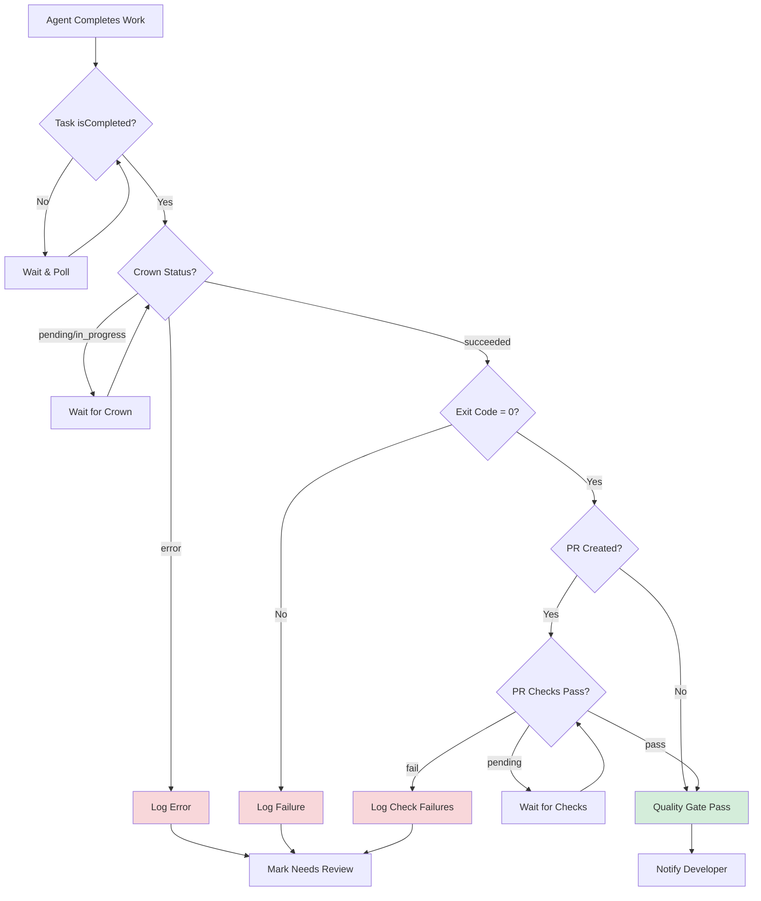
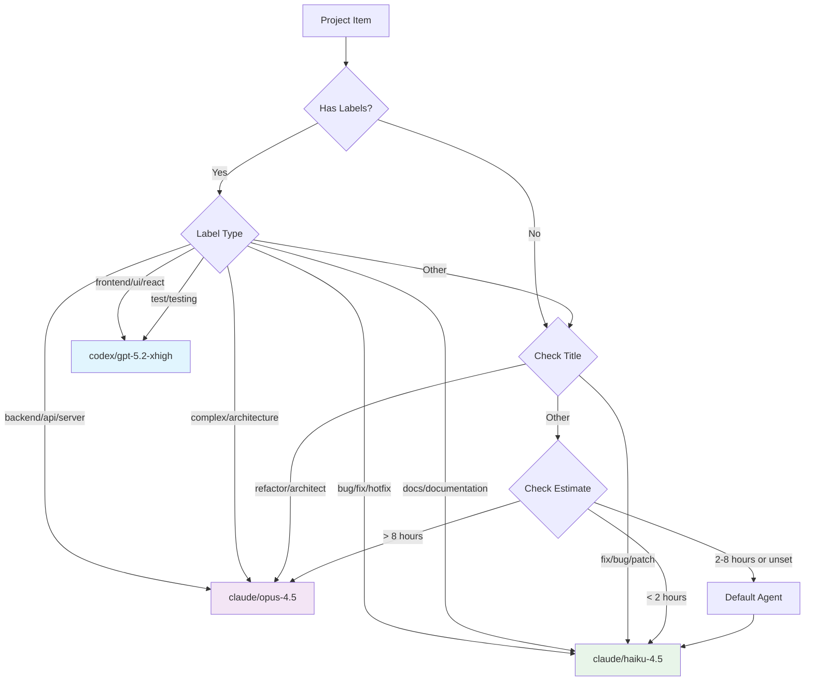
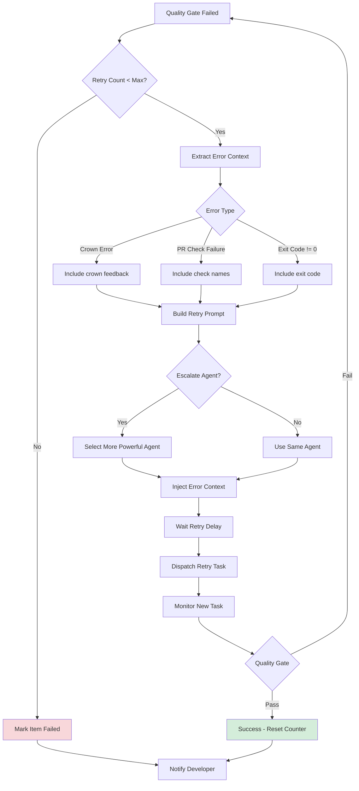

# head-agent - GitHub Projects Polling Loop

> **Purpose**: Run a background loop that polls GitHub Projects for items in "Backlog" (or a configurable status) that don't have linked tasks, then automatically dispatches agents to work on them. Enables fully autonomous development workflows driven by project boards.

## Use Cases

1. **Continuous Development**: Automatically pick up backlog items and start working on them
2. **Team Automation**: Keep development moving without manual task dispatch
3. **Board-Driven Development**: Let the project board drive what work gets done
4. **Scheduled Processing**: Process backlog items at regular intervals

## Quick Start

```bash
# Start a head agent polling loop with auto agent selection (recommended)
devsh head-agent start \
  --project-id PVT_xxx \
  --installation-id 12345 \
  --repo owner/repo \
  --agent auto

# Poll once and dispatch (no loop)
devsh head-agent poll-once \
  --project-id PVT_xxx \
  --installation-id 12345 \
  --repo owner/repo \
  --agent auto

# Check items that would be dispatched (dry run)
devsh project items \
  --project-id PVT_xxx \
  --installation-id 12345 \
  --status Backlog \
  --no-linked-task
```

## Architecture

```
                    GitHub Project (v2)
                           |
                           v
+--------------------------------------------------+
|               Head Agent Polling Loop             |
|                                                   |
|  1. Poll: devsh project items                     |
|           --status Backlog --no-linked-task       |
|                                                   |
|  2. For each new item:                            |
|     devsh task create --from-project-item PVTI_   |
|                       --agent <selected-agent>    |
|                                                   |
|  3. Sleep for poll interval                       |
|                                                   |
|  4. Repeat                                        |
+--------------------------------------------------+
                           |
                           v
               +---------------------+
               |  Spawned Agents     |
               |  (in sandboxes)     |
               +---------------------+
                           |
                           v
               +---------------------+
               |  GitHub PRs         |
               |  (auto-created)     |
               +---------------------+
```

## Shell Script Implementation

You can implement a head agent polling loop using a simple shell script:

```bash
#!/usr/bin/env bash
# head-agent-loop.sh - Polls GitHub Project and dispatches agents for new backlog items
set -euo pipefail

# Configuration
PROJECT_ID="${HEAD_AGENT_PROJECT_ID:-}"
INSTALLATION_ID="${HEAD_AGENT_INSTALLATION_ID:-}"
REPO="${HEAD_AGENT_REPO:-}"
AGENT="${HEAD_AGENT_AGENT:-auto}" # "auto" (recommended) or a fixed agent name
AGENT_DEFAULT="${HEAD_AGENT_AGENT_DEFAULT:-claude/haiku-4.5}"
AGENT_FRONTEND="${HEAD_AGENT_AGENT_FRONTEND:-codex/gpt-5.2-xhigh}"
AGENT_BACKEND="${HEAD_AGENT_AGENT_BACKEND:-claude/opus-4.6}"
POLL_INTERVAL="${HEAD_AGENT_POLL_INTERVAL:-300}"  # 5 minutes default
STATUS="${HEAD_AGENT_STATUS:-Backlog}"
MAX_ITEMS_PER_POLL="${HEAD_AGENT_MAX_ITEMS:-5}"
MAX_RETRIES="${HEAD_AGENT_MAX_RETRIES:-2}"
LOG_FILE="${HEAD_AGENT_LOG_FILE:-/tmp/head-agent.log}"

# Validate configuration
if [[ -z "$PROJECT_ID" || -z "$INSTALLATION_ID" || -z "$REPO" ]]; then
  echo "ERROR: Missing required configuration"
  echo "Set HEAD_AGENT_PROJECT_ID, HEAD_AGENT_INSTALLATION_ID, HEAD_AGENT_REPO"
  exit 1
fi

log() {
  echo "[$(date -Iseconds)] $*" | tee -a "$LOG_FILE"
}

select_agent_for_item() {
  local item_json="$1"

  # Selection priority (highest first):
  # 1) Project field override: fieldValues.Agent (text field containing an agent name)
  # 2) GitHub labels: "frontend" / "backend"
  # 3) Project fields: Area/Component = frontend/backend
  # 4) Default: HEAD_AGENT_AGENT_DEFAULT
  echo "$item_json" | jq -r \
    --arg default "$AGENT_DEFAULT" \
    --arg frontend "$AGENT_FRONTEND" \
    --arg backend "$AGENT_BACKEND" '
      def labels: (.content.labels // []) | map(ascii_downcase);
      def field(name): (.fieldValues[name] // null);
      def fieldStr(name): (field(name) // "") | tostring | ascii_downcase;

      if (field("Agent") != null and (field("Agent") | tostring | length) > 0) then
        field("Agent") | tostring
      elif (labels | index("frontend")) then
        $frontend
      elif (labels | index("backend")) then
        $backend
      elif (fieldStr("Area") == "frontend" or fieldStr("Component") == "frontend") then
        $frontend
      elif (fieldStr("Area") == "backend" or fieldStr("Component") == "backend") then
        $backend
      else
        $default
      end
    '
}

poll_and_dispatch() {
  log "Polling project $PROJECT_ID for items with status '$STATUS' and no linked task..."

  # Get items that need work
  items=$(devsh project items \
    --project-id "$PROJECT_ID" \
    --installation-id "$INSTALLATION_ID" \
    --status "$STATUS" \
    --no-linked-task \
    --first "$MAX_ITEMS_PER_POLL" \
    --json 2>/dev/null || echo '{"items":[]}')

  count=$(echo "$items" | jq '.items | length')
  log "Found $count item(s) ready for dispatch"

  if [[ "$count" -eq 0 ]]; then
    return 0
  fi

  # Dispatch agents for each item
  echo "$items" | jq -c '.items[]' | while read -r item; do
    item_id=$(echo "$item" | jq -r '.id')
    agent_for_item="$AGENT"
    if [[ "$AGENT" == "auto" ]]; then
      agent_for_item=$(select_agent_for_item "$item")
    fi
    log "Dispatching agent ($agent_for_item) for item: $item_id"

    result=$(devsh task create \
      --from-project-item "$item_id" \
      --gh-project-id "$PROJECT_ID" \
      --gh-project-installation-id "$INSTALLATION_ID" \
      --repo "$REPO" \
      --agent "$agent_for_item" \
      --json 2>&1) || true

    if echo "$result" | jq -e '.taskId' >/dev/null 2>&1; then
      task_id=$(echo "$result" | jq -r '.taskId')
      log "SUCCESS: Created task $task_id for item $item_id"
    else
      log "ERROR: Failed to dispatch for $item_id: $result"
    fi

    # Small delay between dispatches to avoid overwhelming the API
    sleep 2
  done
}

retry_failed_tasks() {
  log "Scanning for linked tasks failing quality gate (checks)..."

  tasks=$(devsh task list --json 2>/dev/null || echo '{"tasks":[]}')

  echo "$tasks" | jq -r '
    .tasks[]
    | select(.githubProjectItemId != null and .githubProjectItemId != "")
    | select(.pullRequestUrl != null and .pullRequestUrl != "")
    | select(.mergeStatus != "pr_merged" and .mergeStatus != "pr_closed")
    | .id
  ' | while read -r task_id; do
    [[ -z "$task_id" ]] && continue
    log "Quality gate check: task $task_id"

    result=$(devsh task retry "$task_id" \
      --agent "$AGENT" \
      --max-retries "$MAX_RETRIES" \
      --checks-limit 50 \
      --json 2>/dev/null || true)

    dispatched=$(echo "$result" | jq -r '.dispatched // false' 2>/dev/null || echo "false")
    if [[ "$dispatched" == "true" ]]; then
      log "RETRY: Dispatched retry run for task $task_id"
      # Small delay to avoid rapid re-triggers
      sleep 2
    fi
  done
}

main_loop() {
  log "Starting head agent loop"
  log "  Project ID: $PROJECT_ID"
  log "  Installation ID: $INSTALLATION_ID"
  log "  Repo: $REPO"
  log "  Agent: $AGENT"
  if [[ "$AGENT" == "auto" ]]; then
    log "  Auto selection:"
    log "    default=$AGENT_DEFAULT"
    log "    frontend=$AGENT_FRONTEND"
    log "    backend=$AGENT_BACKEND"
  fi
  log "  Poll Interval: ${POLL_INTERVAL}s"
  log "  Status Filter: $STATUS"
  log "  Max Retries: $MAX_RETRIES"

  while true; do
    poll_and_dispatch
    retry_failed_tasks
    log "Sleeping for ${POLL_INTERVAL}s..."
    sleep "$POLL_INTERVAL"
  done
}

# Entry point
case "${1:-loop}" in
  loop|start)
    main_loop
    ;;
  once|poll-once)
    poll_and_dispatch
    retry_failed_tasks
    ;;
  *)
    echo "Usage: $0 [loop|once]"
    exit 1
    ;;
esac
```

### Running the Loop

```bash
# Set configuration via environment
export HEAD_AGENT_PROJECT_ID="PVT_xxx"
export HEAD_AGENT_INSTALLATION_ID="12345"
export HEAD_AGENT_REPO="owner/repo"
export HEAD_AGENT_AGENT="auto"
export HEAD_AGENT_AGENT_DEFAULT="claude/haiku-4.5"
export HEAD_AGENT_AGENT_FRONTEND="codex/gpt-5.2-xhigh"
export HEAD_AGENT_AGENT_BACKEND="claude/opus-4.6"
export HEAD_AGENT_POLL_INTERVAL="300"  # 5 minutes

# Start the polling loop
./head-agent-loop.sh loop

# Or run once (for testing)
./head-agent-loop.sh once
```

### Running as a Background Service

```bash
# Using systemd (create /etc/systemd/system/head-agent.service)
[Unit]
Description=Head Agent Polling Loop
After=network.target

[Service]
Type=simple
Environment=HEAD_AGENT_PROJECT_ID=PVT_xxx
Environment=HEAD_AGENT_INSTALLATION_ID=12345
Environment=HEAD_AGENT_REPO=owner/repo
Environment=HEAD_AGENT_AGENT=auto
Environment=HEAD_AGENT_AGENT_DEFAULT=claude/haiku-4.5
Environment=HEAD_AGENT_AGENT_FRONTEND=codex/gpt-5.2-xhigh
Environment=HEAD_AGENT_AGENT_BACKEND=claude/opus-4.6
ExecStart=/usr/local/bin/head-agent-loop.sh loop
Restart=always
RestartSec=60

[Install]
WantedBy=multi-user.target

# Enable and start
sudo systemctl daemon-reload
sudo systemctl enable head-agent
sudo systemctl start head-agent
```

## MCP Integration

When running as a head agent in a cloud workspace, you can use MCP tools for orchestration:

```typescript
function selectAgent(item: any): string {
  // Priority:
  // 1) Project field override: fieldValues.Agent
  // 2) Labels: frontend/backend
  // 3) Fields: Area/Component
  // 4) Default
  const override = String(item?.fieldValues?.Agent ?? "").trim();
  if (override) return override;

  const labels = (item?.content?.labels ?? []).map((l: string) => l.toLowerCase());
  if (labels.includes("frontend")) return "codex/gpt-5.2-xhigh";
  if (labels.includes("backend")) return "claude/opus-4.6";

  const area = String(item?.fieldValues?.Area ?? item?.fieldValues?.Component ?? "").toLowerCase();
  if (area === "frontend") return "codex/gpt-5.2-xhigh";
  if (area === "backend") return "claude/opus-4.6";

  return "claude/haiku-4.5";
}

// Poll for new items programmatically
async function pollForNewItems() {
  // Use devsh CLI to get items
  const result = await execAsync(`devsh project items \
    --project-id ${projectId} \
    --installation-id ${installationId} \
    --status Backlog \
    --no-linked-task \
    --json`);

  const items = JSON.parse(result.stdout).items;

  for (const item of items) {
    // Spawn agent for each item
    await spawn_agent({
      prompt: `Work on project item: ${item.content?.title}\n\n${item.content?.body || ''}`,
      agentName: selectAgent(item),
      repo: "owner/repo",
    });
  }
}

// Run polling loop
async function headAgentLoop(pollIntervalMs = 300000) {
  while (true) {
    try {
      await pollForNewItems();
    } catch (err) {
      console.error("Poll error:", err);
    }
    await sleep(pollIntervalMs);
  }
}
```

## Configuration Reference

| Environment Variable | CLI Flag | Default | Description |
|---------------------|----------|---------|-------------|
| `HEAD_AGENT_PROJECT_ID` | `--project-id` | (required) | GitHub Project node ID (PVT_xxx) |
| `HEAD_AGENT_INSTALLATION_ID` | `--installation-id` | (required) | GitHub App installation ID |
| `HEAD_AGENT_REPO` | `--repo` | (required) | Repository in owner/repo format |
| `HEAD_AGENT_AGENT` | `--agent` | `auto` | `auto` (recommended) or a fixed agent to dispatch |
| `HEAD_AGENT_AGENT_DEFAULT` | - | `claude/haiku-4.5` | Default agent when `HEAD_AGENT_AGENT=auto` |
| `HEAD_AGENT_AGENT_FRONTEND` | - | `codex/gpt-5.2-xhigh` | Agent for `frontend` label/field matches |
| `HEAD_AGENT_AGENT_BACKEND` | - | `claude/opus-4.6` | Agent for `backend` label/field matches |
| `HEAD_AGENT_POLL_INTERVAL` | `--poll-interval` | `300` | Seconds between polls |
| `HEAD_AGENT_STATUS` | `--status` | `Backlog` | Project status to filter by |
| `HEAD_AGENT_MAX_ITEMS` | `--max-items` | `5` | Max items to dispatch per poll |
| `HEAD_AGENT_MAX_RETRIES` | - | `2` | Max quality-gate retries per task |
| `HEAD_AGENT_LOG_FILE` | `--log-file` | `/tmp/head-agent.log` | Log file path |

## Retry (Quality Gate)

When a dispatched task produces a PR but fails checks, the head agent can automatically
re-dispatch a retry run with error context injected from the previous attempt.

The retry uses:
- **Crown feedback** (crownEvaluationStatus/error + crowned run reason when available)
- **Check failures** (GitHub Actions workflows + check_run apps + deployments + legacy statuses)

The retry run is started on the PR's existing branch (so it updates the same PR) and includes
a `cmux-head-agent-retry` marker so the system can enforce retry limits.

### Manual Retry

```bash
devsh task retry <task-id> --max-retries 2
devsh task retry <task-id> --dry-run
```

## Workflow Integration

### Project Board Setup

1. **Create a GitHub Project (v2)** with columns:
   - `Backlog` - Items ready for agents to work on
   - `In Progress` - Items with active agent work
   - `Done` - Completed items

2. **Configure Project Status Field**: Ensure your project has a "Status" single-select field with the column names above.

3. **Add Items to Backlog**: Add issues, PRs, or draft items to the project and set their status to "Backlog".

### Automatic Status Updates

When agents complete work, the status field is automatically updated:
- Task created: Status changes to "In Progress"
- Agent completes: Status changes to "Done" (if PR merged) or stays "In Progress"

## Best Practices

1. **Start with Low Concurrency**: Begin with `MAX_ITEMS_PER_POLL=1` to validate your workflow before scaling up.

2. **Use Appropriate Agents**: Match agent capability to task complexity:
   - `claude/haiku-4.5` - Quick fixes, simple tasks
   - `claude/sonnet-4.5` - Medium complexity features
   - `claude/opus-4.5` - Complex architectural changes

3. **Route Work with Metadata** (recommended):
   - Add GitHub labels like `frontend` / `backend` to issues/PRs
   - Add a project text field named `Agent` to hard-pin specific items to an agent
   - Optionally add project fields like `Area` or `Component` with values `frontend` / `backend`

4. **Monitor Logs**: Watch the log file for errors and dispatch success rates.

5. **Set Reasonable Poll Intervals**: 5-15 minutes is usually sufficient. Too frequent polling wastes API calls.

6. **Use Dry Runs First**: Test with `devsh project items --status Backlog --no-linked-task` to see what would be dispatched.

7. **Configure Auto-PR**: Enable Auto-PR in settings so completed work automatically creates pull requests.

8. **Handle Failures**: Use quality-gate retries (`devsh task retry`) with a max retry limit before escalating to manual review.

## Troubleshooting

### No Items Being Dispatched

```bash
# Check if there are items in the target status
devsh project items --project-id PVT_xxx --installation-id 12345 --status Backlog

# Check if items already have linked tasks
devsh project items --project-id PVT_xxx --installation-id 12345 --status Backlog --no-linked-task

# Verify authentication
devsh auth status
```

### Task Creation Failures

```bash
# Test task creation manually
devsh task create \
  --from-project-item PVTI_xxx \
  --gh-project-id PVT_xxx \
  --gh-project-installation-id 12345 \
  --repo owner/repo \
  --agent claude/haiku-4.5 \
  --json
```

### Finding Project and Installation IDs

```bash
# List projects
devsh project list --installation-id <installation-id>

# Get installation ID from GitHub App settings
# Or use: gh api /user/installations | jq '.installations[] | {id, account: .account.login}'
```

## Quality Gate

The head agent includes a quality gate that verifies agent output before notifying developers. This ensures only high-quality work reaches human reviewers.

### Quality Gate Architecture

```
                    Agent Completes Work
                           |
                           v
+--------------------------------------------------+
|               Quality Gate Checks                 |
|                                                   |
|  1. Wait for task completion (crown evaluation)   |
|     devsh task show <task-id> --json              |
|     Check: crownEvaluationStatus == "succeeded"   |
|                                                   |
|  2. Check PR status (if PR created)               |
|     gh pr checks <pr-url> --json                  |
|     Check: All required checks pass               |
|                                                   |
|  3. Verify exit code                              |
|     Check: Agent exit code == 0                   |
|                                                   |
+--------------------------------------------------+
                           |
              +------------+------------+
              |                         |
              v                         v
     Quality Passed              Quality Failed
              |                         |
              v                         v
    Notify Developer           Log failure, retry
    (PR ready for review)      or escalate
```

### Quality Thresholds

| Check | Threshold | Action on Failure |
|-------|-----------|-------------------|
| Crown Status | `succeeded` | Wait and retry (up to 10 min) |
| Crown Error | `null` | Log error, mark task as needs-review |
| Exit Code | `0` | Log failure, do not notify |
| PR Checks | All pass | Wait and retry (up to 15 min) |
| PR Mergeable | `true` | Wait for conflicts resolution |

### Shell Script Implementation with Quality Gate

```bash
#!/usr/bin/env bash
# head-agent-loop-with-quality-gate.sh
# Polls GitHub Project, dispatches agents, and verifies quality before notifying
set -euo pipefail

# Configuration
PROJECT_ID="${HEAD_AGENT_PROJECT_ID:-}"
INSTALLATION_ID="${HEAD_AGENT_INSTALLATION_ID:-}"
REPO="${HEAD_AGENT_REPO:-}"
AGENT="${HEAD_AGENT_AGENT:-claude/haiku-4.5}"
POLL_INTERVAL="${HEAD_AGENT_POLL_INTERVAL:-300}"  # 5 minutes default
STATUS="${HEAD_AGENT_STATUS:-Backlog}"
MAX_ITEMS_PER_POLL="${HEAD_AGENT_MAX_ITEMS:-5}"
LOG_FILE="${HEAD_AGENT_LOG_FILE:-/tmp/head-agent.log}"

# Quality gate configuration
QUALITY_GATE_ENABLED="${HEAD_AGENT_QUALITY_GATE:-true}"
CROWN_WAIT_TIMEOUT="${HEAD_AGENT_CROWN_TIMEOUT:-600}"      # 10 minutes
PR_CHECKS_TIMEOUT="${HEAD_AGENT_PR_CHECKS_TIMEOUT:-900}"   # 15 minutes
NOTIFY_ON_SUCCESS="${HEAD_AGENT_NOTIFY_SUCCESS:-true}"
NOTIFY_ON_FAILURE="${HEAD_AGENT_NOTIFY_FAILURE:-false}"

# Validate configuration
if [[ -z "$PROJECT_ID" || -z "$INSTALLATION_ID" || -z "$REPO" ]]; then
  echo "ERROR: Missing required configuration"
  echo "Set HEAD_AGENT_PROJECT_ID, HEAD_AGENT_INSTALLATION_ID, HEAD_AGENT_REPO"
  exit 1
fi

log() {
  echo "[$(date -Iseconds)] $*" | tee -a "$LOG_FILE"
}

# Wait for crown evaluation to complete
wait_for_crown() {
  local task_id="$1"
  local timeout="${2:-$CROWN_WAIT_TIMEOUT}"
  local start_time=$(date +%s)

  log "Waiting for crown evaluation on task $task_id (timeout: ${timeout}s)..."

  while true; do
    local elapsed=$(($(date +%s) - start_time))
    if [[ $elapsed -ge $timeout ]]; then
      log "ERROR: Crown evaluation timeout for task $task_id after ${elapsed}s"
      return 1
    fi

    local task_json=$(devsh task show "$task_id" --json 2>/dev/null || echo '{}')
    local crown_status=$(echo "$task_json" | jq -r '.crownEvaluationStatus // "pending"')
    local crown_error=$(echo "$task_json" | jq -r '.crownEvaluationError // ""')

    case "$crown_status" in
      "succeeded")
        log "Crown evaluation succeeded for task $task_id"
        return 0
        ;;
      "error")
        log "ERROR: Crown evaluation failed for task $task_id: $crown_error"
        return 1
        ;;
      "pending"|"in_progress")
        log "Crown evaluation $crown_status for task $task_id (${elapsed}s elapsed)..."
        sleep 10
        ;;
      *)
        log "Unknown crown status '$crown_status' for task $task_id"
        sleep 10
        ;;
    esac
  done
}

# Wait for PR checks to pass
wait_for_pr_checks() {
  local pr_url="$1"
  local timeout="${2:-$PR_CHECKS_TIMEOUT}"
  local start_time=$(date +%s)

  if [[ -z "$pr_url" || "$pr_url" == "null" || "$pr_url" == "pending" ]]; then
    log "No PR URL available, skipping PR checks"
    return 0
  fi

  log "Waiting for PR checks on $pr_url (timeout: ${timeout}s)..."

  while true; do
    local elapsed=$(($(date +%s) - start_time))
    if [[ $elapsed -ge $timeout ]]; then
      log "ERROR: PR checks timeout for $pr_url after ${elapsed}s"
      return 1
    fi

    # Get PR checks status using gh CLI
    local checks_json=$(gh pr checks "$pr_url" --json name,state,conclusion 2>/dev/null || echo '[]')
    local total_checks=$(echo "$checks_json" | jq 'length')

    if [[ "$total_checks" -eq 0 ]]; then
      log "No checks configured for PR, passing quality gate"
      return 0
    fi

    local pending=$(echo "$checks_json" | jq '[.[] | select(.state == "PENDING" or .state == "IN_PROGRESS" or .state == "QUEUED")] | length')
    local failed=$(echo "$checks_json" | jq '[.[] | select(.conclusion == "FAILURE" or .conclusion == "CANCELLED" or .conclusion == "TIMED_OUT")] | length')
    local passed=$(echo "$checks_json" | jq '[.[] | select(.conclusion == "SUCCESS" or .conclusion == "SKIPPED")] | length')

    log "PR checks: $passed passed, $pending pending, $failed failed (${elapsed}s elapsed)"

    if [[ "$pending" -eq 0 ]]; then
      if [[ "$failed" -eq 0 ]]; then
        log "All PR checks passed for $pr_url"
        return 0
      else
        log "ERROR: $failed PR checks failed for $pr_url"
        # List failed checks
        echo "$checks_json" | jq -r '.[] | select(.conclusion == "FAILURE" or .conclusion == "CANCELLED" or .conclusion == "TIMED_OUT") | "  - \(.name): \(.conclusion)"' | while read -r line; do
          log "$line"
        done
        return 1
      fi
    fi

    sleep 30
  done
}

# Verify agent exit code
check_exit_code() {
  local task_id="$1"

  local task_json=$(devsh task show "$task_id" --json 2>/dev/null || echo '{}')
  local runs=$(echo "$task_json" | jq '.taskRuns // []')

  # Check if any run has non-zero exit code
  local failed_runs=$(echo "$runs" | jq '[.[] | select(.exitCode != null and .exitCode != 0)] | length')

  if [[ "$failed_runs" -gt 0 ]]; then
    log "ERROR: $failed_runs task run(s) have non-zero exit code"
    echo "$runs" | jq -r '.[] | select(.exitCode != null and .exitCode != 0) | "  - \(.id): exit code \(.exitCode)"' | while read -r line; do
      log "$line"
    done
    return 1
  fi

  log "All task runs completed with exit code 0"
  return 0
}

# Run quality gate checks
run_quality_gate() {
  local task_id="$1"

  if [[ "$QUALITY_GATE_ENABLED" != "true" ]]; then
    log "Quality gate disabled, skipping checks"
    return 0
  fi

  log "Running quality gate for task $task_id..."

  # 1. Wait for crown evaluation
  if ! wait_for_crown "$task_id"; then
    log "Quality gate FAILED: Crown evaluation did not succeed"
    return 1
  fi

  # 2. Check exit codes
  if ! check_exit_code "$task_id"; then
    log "Quality gate FAILED: Non-zero exit code detected"
    return 1
  fi

  # 3. Get PR URL and check PR status
  local task_json=$(devsh task show "$task_id" --json 2>/dev/null || echo '{}')
  local pr_url=$(echo "$task_json" | jq -r '.taskRuns[0].pullRequestUrl // ""')

  if [[ -n "$pr_url" && "$pr_url" != "null" && "$pr_url" != "pending" ]]; then
    if ! wait_for_pr_checks "$pr_url"; then
      log "Quality gate FAILED: PR checks did not pass"
      return 1
    fi
  fi

  log "Quality gate PASSED for task $task_id"
  return 0
}

# Notify developer about task completion
notify_developer() {
  local task_id="$1"
  local status="$2"

  local task_json=$(devsh task show "$task_id" --json 2>/dev/null || echo '{}')
  local prompt=$(echo "$task_json" | jq -r '.prompt // "Unknown task"')
  local pr_url=$(echo "$task_json" | jq -r '.taskRuns[0].pullRequestUrl // ""')

  if [[ "$status" == "success" && "$NOTIFY_ON_SUCCESS" == "true" ]]; then
    log "NOTIFY: Task $task_id completed successfully"
    log "  Prompt: $prompt"
    if [[ -n "$pr_url" && "$pr_url" != "null" ]]; then
      log "  PR: $pr_url"
    fi
    # Add your notification method here (Slack, email, etc.)
    # Example: curl -X POST "$SLACK_WEBHOOK" -d "{\"text\": \"Task completed: $prompt\\nPR: $pr_url\"}"
  fi

  if [[ "$status" == "failure" && "$NOTIFY_ON_FAILURE" == "true" ]]; then
    log "NOTIFY: Task $task_id failed quality gate"
    log "  Prompt: $prompt"
    # Add your failure notification method here
  fi
}

poll_and_dispatch() {
  log "Polling project $PROJECT_ID for items with status '$STATUS' and no linked task..."

  # Get items that need work
  items=$(devsh project items \
    --project-id "$PROJECT_ID" \
    --installation-id "$INSTALLATION_ID" \
    --status "$STATUS" \
    --no-linked-task \
    --first "$MAX_ITEMS_PER_POLL" \
    --json 2>/dev/null || echo '{"items":[]}')

  count=$(echo "$items" | jq '.items | length')
  log "Found $count item(s) ready for dispatch"

  if [[ "$count" -eq 0 ]]; then
    return 0
  fi

  # Dispatch agents for each item
  echo "$items" | jq -r '.items[].id' | while read -r item_id; do
    log "Dispatching agent for item: $item_id"

    result=$(devsh task create \
      --from-project-item "$item_id" \
      --gh-project-id "$PROJECT_ID" \
      --gh-project-installation-id "$INSTALLATION_ID" \
      --repo "$REPO" \
      --agent "$AGENT" \
      --json 2>&1) || true

    if echo "$result" | jq -e '.taskId' >/dev/null 2>&1; then
      task_id=$(echo "$result" | jq -r '.taskId')
      log "SUCCESS: Created task $task_id for item $item_id"

      # Queue quality gate check (run in background)
      (
        # Wait for task to complete
        log "Waiting for task $task_id to complete..."
        sleep 60  # Initial wait before checking

        # Poll for task completion
        for i in {1..60}; do  # Up to 60 checks (10 minutes with 10s intervals)
          task_status=$(devsh task show "$task_id" --json 2>/dev/null | jq -r '.isCompleted // false')
          if [[ "$task_status" == "true" ]]; then
            log "Task $task_id completed, running quality gate..."
            if run_quality_gate "$task_id"; then
              notify_developer "$task_id" "success"
            else
              notify_developer "$task_id" "failure"
            fi
            break
          fi
          sleep 10
        done
      ) &
    else
      log "ERROR: Failed to dispatch for $item_id: $result"
    fi

    # Small delay between dispatches to avoid overwhelming the API
    sleep 2
  done
}

main_loop() {
  log "Starting head agent loop with quality gate"
  log "  Project ID: $PROJECT_ID"
  log "  Installation ID: $INSTALLATION_ID"
  log "  Repo: $REPO"
  log "  Agent: $AGENT"
  log "  Poll Interval: ${POLL_INTERVAL}s"
  log "  Status Filter: $STATUS"
  log "  Quality Gate: $QUALITY_GATE_ENABLED"
  log "  Crown Timeout: ${CROWN_WAIT_TIMEOUT}s"
  log "  PR Checks Timeout: ${PR_CHECKS_TIMEOUT}s"

  while true; do
    poll_and_dispatch
    log "Sleeping for ${POLL_INTERVAL}s..."
    sleep "$POLL_INTERVAL"
  done
}

# Entry point
case "${1:-loop}" in
  loop|start)
    main_loop
    ;;
  once|poll-once)
    poll_and_dispatch
    ;;
  quality-gate)
    # Run quality gate for a specific task
    if [[ -z "${2:-}" ]]; then
      echo "Usage: $0 quality-gate <task-id>"
      exit 1
    fi
    run_quality_gate "$2"
    ;;
  *)
    echo "Usage: $0 [loop|once|quality-gate <task-id>]"
    exit 1
    ;;
esac
```

### Quality Gate Configuration

| Environment Variable | Default | Description |
|---------------------|---------|-------------|
| `HEAD_AGENT_QUALITY_GATE` | `true` | Enable/disable quality gate checks |
| `HEAD_AGENT_CROWN_TIMEOUT` | `600` | Seconds to wait for crown evaluation |
| `HEAD_AGENT_PR_CHECKS_TIMEOUT` | `900` | Seconds to wait for PR checks |
| `HEAD_AGENT_NOTIFY_SUCCESS` | `true` | Notify on successful quality gate |
| `HEAD_AGENT_NOTIFY_FAILURE` | `false` | Notify on failed quality gate |

### Using MCP Tools for Quality Gate

When running as a head agent in a cloud workspace, use MCP tools:

```typescript
// Quality gate using MCP tools
async function runQualityGate(taskId: string): Promise<boolean> {
  // 1. Wait for task completion using orchestration tools
  const status = await get_agent_status({ orchestrationTaskId: taskId });

  if (status.status !== "completed") {
    console.log(`Task ${taskId} not completed yet: ${status.status}`);
    return false;
  }

  // 2. Get task details via devsh CLI
  const taskJson = await execAsync(`devsh task show ${taskId} --json`);
  const task = JSON.parse(taskJson.stdout);

  // 3. Check crown evaluation status
  if (task.crownEvaluationStatus !== "succeeded") {
    console.log(`Crown evaluation not succeeded: ${task.crownEvaluationStatus}`);
    if (task.crownEvaluationError) {
      console.log(`Crown error: ${task.crownEvaluationError}`);
    }
    return false;
  }

  // 4. Check exit codes
  const failedRuns = task.taskRuns.filter(r => r.exitCode !== null && r.exitCode !== 0);
  if (failedRuns.length > 0) {
    console.log(`Found ${failedRuns.length} runs with non-zero exit code`);
    return false;
  }

  // 5. Check PR status if available
  const prUrl = task.taskRuns[0]?.pullRequestUrl;
  if (prUrl && prUrl !== "pending") {
    const checksJson = await execAsync(`gh pr checks ${prUrl} --json name,state,conclusion`);
    const checks = JSON.parse(checksJson.stdout);

    const failed = checks.filter(c =>
      ["FAILURE", "CANCELLED", "TIMED_OUT"].includes(c.conclusion)
    );

    if (failed.length > 0) {
      console.log(`PR checks failed: ${failed.map(c => c.name).join(", ")}`);
      return false;
    }
  }

  console.log(`Quality gate PASSED for task ${taskId}`);
  return true;
}

// Example usage in head agent loop
async function dispatchAndVerify(item: ProjectItem) {
  // Create task
  const result = await createTask(item);
  const taskId = result.taskId;

  // Wait for completion
  await wait_for_agent({
    orchestrationTaskId: taskId,
    timeout: 1800000  // 30 minutes
  });

  // Run quality gate
  const passed = await runQualityGate(taskId);

  if (passed) {
    await send_message({
      to: "developer",
      message: `Task ${taskId} completed and passed quality gate. PR ready for review.`,
      type: "status"
    });
  } else {
    await append_daily_log({
      content: `Task ${taskId} failed quality gate. Manual review required.`
    });
  }
}
```

### Quality Gate Flowchart



## Auto Agent Selection

The head agent can automatically select the optimal agent based on GitHub Project item metadata (labels, fields, and content analysis). This ensures the right agent handles each task.

### Agent Selection Rules

| Criteria | Agent | Reasoning |
|----------|-------|-----------|
| Label: `frontend`, `ui`, `react` | `codex/gpt-5.2-xhigh` | Codex excels at frontend/UI work |
| Label: `backend`, `api`, `server` | `claude/opus-4.5` | Claude excels at backend architecture |
| Label: `bug`, `fix`, `hotfix` | `claude/haiku-4.5` | Quick fixes benefit from fast agent |
| Label: `docs`, `documentation` | `claude/haiku-4.5` | Documentation is straightforward |
| Label: `complex`, `architecture` | `claude/opus-4.5` | Complex tasks need powerful reasoning |
| Label: `test`, `testing` | `codex/gpt-5.2-xhigh` | Codex is strong at test generation |
| Title contains "refactor" | `claude/opus-4.5` | Refactoring needs deep understanding |
| Estimate field > 8 hours | `claude/opus-4.5` | Large tasks need powerful agent |
| Estimate field < 2 hours | `claude/haiku-4.5` | Small tasks use fast agent |
| Default (no match) | `claude/haiku-4.5` | Conservative default for cost |

### Shell Script Implementation

```bash
#!/usr/bin/env bash
# agent-selector.sh - Select optimal agent based on item metadata

select_agent() {
  local item_json="$1"
  local default_agent="${2:-claude/haiku-4.5}"

  # Extract item metadata
  local title=$(echo "$item_json" | jq -r '.content.title // ""' | tr '[:upper:]' '[:lower:]')
  local labels=$(echo "$item_json" | jq -r '.content.labels // [] | .[].name' 2>/dev/null | tr '[:upper:]' '[:lower:]')
  local estimate=$(echo "$item_json" | jq -r '.fieldValues.Estimate // 0')

  # Check labels first (highest priority)
  if echo "$labels" | grep -qE '^(frontend|ui|react|vue|css|styling)$'; then
    echo "codex/gpt-5.2-xhigh"
    return
  fi

  if echo "$labels" | grep -qE '^(backend|api|server|database|auth)$'; then
    echo "claude/opus-4.5"
    return
  fi

  if echo "$labels" | grep -qE '^(bug|fix|hotfix|patch)$'; then
    echo "claude/haiku-4.5"
    return
  fi

  if echo "$labels" | grep -qE '^(docs|documentation|readme)$'; then
    echo "claude/haiku-4.5"
    return
  fi

  if echo "$labels" | grep -qE '^(complex|architecture|design|refactor)$'; then
    echo "claude/opus-4.5"
    return
  fi

  if echo "$labels" | grep -qE '^(test|testing|e2e|unit-test)$'; then
    echo "codex/gpt-5.2-xhigh"
    return
  fi

  # Check title keywords (second priority)
  if echo "$title" | grep -qE '(refactor|architect|redesign|migrate)'; then
    echo "claude/opus-4.5"
    return
  fi

  if echo "$title" | grep -qE '(fix|bug|patch|typo)'; then
    echo "claude/haiku-4.5"
    return
  fi

  # Check estimate field (third priority)
  if [[ "$estimate" =~ ^[0-9]+$ ]]; then
    if [[ "$estimate" -gt 8 ]]; then
      echo "claude/opus-4.5"
      return
    fi
    if [[ "$estimate" -lt 2 ]]; then
      echo "claude/haiku-4.5"
      return
    fi
  fi

  # Default agent
  echo "$default_agent"
}

# Usage in head agent loop
dispatch_with_auto_agent() {
  local item_json="$1"
  local item_id=$(echo "$item_json" | jq -r '.id')

  # Auto-select agent based on item metadata
  local agent=$(select_agent "$item_json")
  log "Auto-selected agent: $agent for item $item_id"

  # Dispatch with selected agent
  devsh task create \
    --from-project-item "$item_id" \
    --gh-project-id "$PROJECT_ID" \
    --gh-project-installation-id "$INSTALLATION_ID" \
    --repo "$REPO" \
    --agent "$agent" \
    --json
}
```

### Agent Selection Configuration

Override default selection rules via environment variables:

```bash
# Force a specific agent (disables auto-selection)
export HEAD_AGENT_AGENT="claude/opus-4.5"

# Enable auto-selection with custom defaults
export HEAD_AGENT_AUTO_SELECT="true"
export HEAD_AGENT_DEFAULT_AGENT="claude/haiku-4.5"
export HEAD_AGENT_FRONTEND_AGENT="codex/gpt-5.2-xhigh"
export HEAD_AGENT_BACKEND_AGENT="claude/opus-4.5"
export HEAD_AGENT_BUG_AGENT="claude/haiku-4.5"
export HEAD_AGENT_COMPLEX_AGENT="claude/opus-4.5"
```

### Using MCP Tools for Agent Selection

```typescript
// Agent selection using MCP tools
interface AgentSelection {
  agent: string;
  reason: string;
}

function selectAgent(item: ProjectItem): AgentSelection {
  const title = (item.content?.title || "").toLowerCase();
  const labels = item.content?.labels?.map(l => l.name.toLowerCase()) || [];
  const estimate = parseInt(item.fieldValues?.Estimate || "0");

  // Check labels
  if (labels.some(l => ["frontend", "ui", "react", "vue", "css"].includes(l))) {
    return { agent: "codex/gpt-5.2-xhigh", reason: "Frontend label detected" };
  }

  if (labels.some(l => ["backend", "api", "server", "database", "auth"].includes(l))) {
    return { agent: "claude/opus-4.5", reason: "Backend label detected" };
  }

  if (labels.some(l => ["bug", "fix", "hotfix", "patch"].includes(l))) {
    return { agent: "claude/haiku-4.5", reason: "Bug fix label detected" };
  }

  if (labels.some(l => ["complex", "architecture", "design", "refactor"].includes(l))) {
    return { agent: "claude/opus-4.5", reason: "Complex task label detected" };
  }

  if (labels.some(l => ["test", "testing", "e2e", "unit-test"].includes(l))) {
    return { agent: "codex/gpt-5.2-xhigh", reason: "Testing label detected" };
  }

  // Check title keywords
  if (/refactor|architect|redesign|migrate/.test(title)) {
    return { agent: "claude/opus-4.5", reason: "Complex keyword in title" };
  }

  if (/fix|bug|patch|typo/.test(title)) {
    return { agent: "claude/haiku-4.5", reason: "Quick fix keyword in title" };
  }

  // Check estimate
  if (estimate > 8) {
    return { agent: "claude/opus-4.5", reason: `Large estimate: ${estimate}h` };
  }

  if (estimate < 2 && estimate > 0) {
    return { agent: "claude/haiku-4.5", reason: `Small estimate: ${estimate}h` };
  }

  // Default
  return { agent: "claude/haiku-4.5", reason: "Default selection" };
}

// Example usage
async function pollWithAutoSelect() {
  const items = await getBacklogItems();

  for (const item of items) {
    const { agent, reason } = selectAgent(item);
    console.log(`Item ${item.id}: Selected ${agent} (${reason})`);

    await spawn_agent({
      prompt: buildPromptFromItem(item),
      agentName: agent,
      repo: REPO,
    });
  }
}
```

### Agent Selection Flowchart



## Retry Logic with Error Context

When an agent fails the quality gate, the head agent can automatically retry with error context injected into the prompt. This helps the next agent avoid the same mistakes.

### Retry Configuration

| Variable | Default | Description |
|----------|---------|-------------|
| `HEAD_AGENT_MAX_RETRIES` | `2` | Maximum retry attempts per item |
| `HEAD_AGENT_RETRY_DELAY` | `60` | Seconds between retries |
| `HEAD_AGENT_INJECT_ERROR_CONTEXT` | `true` | Include error context in retry prompt |
| `HEAD_AGENT_ESCALATE_ON_FAILURE` | `true` | Use more powerful agent on retry |

### Shell Script Implementation

```bash
#!/usr/bin/env bash
# head-agent-retry.sh - Retry logic with error context injection

MAX_RETRIES="${HEAD_AGENT_MAX_RETRIES:-2}"
RETRY_DELAY="${HEAD_AGENT_RETRY_DELAY:-60}"
INJECT_ERROR_CONTEXT="${HEAD_AGENT_INJECT_ERROR_CONTEXT:-true}"
ESCALATE_ON_FAILURE="${HEAD_AGENT_ESCALATE_ON_FAILURE:-true}"

# Track retry counts (stored in memory file)
RETRY_STATE_FILE="${HEAD_AGENT_RETRY_STATE:-/tmp/head-agent-retries.json}"

get_retry_count() {
  local item_id="$1"
  if [[ -f "$RETRY_STATE_FILE" ]]; then
    jq -r ".\"$item_id\" // 0" "$RETRY_STATE_FILE"
  else
    echo "0"
  fi
}

increment_retry_count() {
  local item_id="$1"
  local current=$(get_retry_count "$item_id")
  local new=$((current + 1))

  if [[ -f "$RETRY_STATE_FILE" ]]; then
    jq ".\"$item_id\" = $new" "$RETRY_STATE_FILE" > "${RETRY_STATE_FILE}.tmp"
    mv "${RETRY_STATE_FILE}.tmp" "$RETRY_STATE_FILE"
  else
    echo "{\"$item_id\": $new}" > "$RETRY_STATE_FILE"
  fi

  echo "$new"
}

reset_retry_count() {
  local item_id="$1"
  if [[ -f "$RETRY_STATE_FILE" ]]; then
    jq "del(.\"$item_id\")" "$RETRY_STATE_FILE" > "${RETRY_STATE_FILE}.tmp"
    mv "${RETRY_STATE_FILE}.tmp" "$RETRY_STATE_FILE"
  fi
}

# Extract error context from failed task
get_error_context() {
  local task_id="$1"

  local task_json=$(devsh task show "$task_id" --json 2>/dev/null || echo '{}')

  local crown_error=$(echo "$task_json" | jq -r '.crownEvaluationError // ""')
  local crown_reason=$(echo "$task_json" | jq -r '.crownReason // ""')
  local exit_code=$(echo "$task_json" | jq -r '.taskRuns[0].exitCode // ""')
  local pr_url=$(echo "$task_json" | jq -r '.taskRuns[0].pullRequestUrl // ""')

  # Get PR check failures if available
  local check_failures=""
  if [[ -n "$pr_url" && "$pr_url" != "null" && "$pr_url" != "pending" ]]; then
    check_failures=$(gh pr checks "$pr_url" --json name,conclusion 2>/dev/null | \
      jq -r '.[] | select(.conclusion == "FAILURE") | "- \(.name): FAILED"' 2>/dev/null || echo "")
  fi

  # Build error context string
  local context=""

  if [[ -n "$crown_error" && "$crown_error" != "null" ]]; then
    context+="Crown Evaluation Error:\n$crown_error\n\n"
  fi

  if [[ -n "$crown_reason" && "$crown_reason" != "null" ]]; then
    context+="Crown Evaluation Reason:\n$crown_reason\n\n"
  fi

  if [[ -n "$exit_code" && "$exit_code" != "0" && "$exit_code" != "null" ]]; then
    context+="Previous Exit Code: $exit_code\n\n"
  fi

  if [[ -n "$check_failures" ]]; then
    context+="Failed PR Checks:\n$check_failures\n\n"
  fi

  echo -e "$context"
}

# Escalate to more powerful agent
escalate_agent() {
  local current_agent="$1"

  case "$current_agent" in
    "claude/haiku-4.5")
      echo "claude/sonnet-4.5"
      ;;
    "claude/sonnet-4.5")
      echo "claude/opus-4.5"
      ;;
    "codex/gpt-5.1-codex-mini")
      echo "codex/gpt-5.2-xhigh"
      ;;
    *)
      # Already at max, return same
      echo "$current_agent"
      ;;
  esac
}

# Retry a failed task with error context
retry_task() {
  local item_id="$1"
  local failed_task_id="$2"
  local original_prompt="$3"
  local original_agent="$4"

  local retry_count=$(get_retry_count "$item_id")

  if [[ "$retry_count" -ge "$MAX_RETRIES" ]]; then
    log "ERROR: Max retries ($MAX_RETRIES) exceeded for item $item_id"
    return 1
  fi

  # Increment retry count
  retry_count=$(increment_retry_count "$item_id")
  log "Retry attempt $retry_count/$MAX_RETRIES for item $item_id"

  # Get error context from failed task
  local error_context=""
  if [[ "$INJECT_ERROR_CONTEXT" == "true" ]]; then
    error_context=$(get_error_context "$failed_task_id")
  fi

  # Build retry prompt with error context
  local retry_prompt="$original_prompt"
  if [[ -n "$error_context" ]]; then
    retry_prompt="RETRY ATTEMPT $retry_count/$MAX_RETRIES

IMPORTANT: A previous attempt at this task failed. Please review the error context below and avoid the same mistakes.

=== ERROR CONTEXT FROM PREVIOUS ATTEMPT ===
$error_context
=== END ERROR CONTEXT ===

ORIGINAL TASK:
$original_prompt"
  fi

  # Escalate agent if configured
  local retry_agent="$original_agent"
  if [[ "$ESCALATE_ON_FAILURE" == "true" ]]; then
    retry_agent=$(escalate_agent "$original_agent")
    if [[ "$retry_agent" != "$original_agent" ]]; then
      log "Escalating from $original_agent to $retry_agent"
    fi
  fi

  # Wait before retry
  log "Waiting ${RETRY_DELAY}s before retry..."
  sleep "$RETRY_DELAY"

  # Dispatch retry
  local result=$(devsh task create \
    --from-project-item "$item_id" \
    --gh-project-id "$PROJECT_ID" \
    --gh-project-installation-id "$INSTALLATION_ID" \
    --repo "$REPO" \
    --agent "$retry_agent" \
    --prompt "$retry_prompt" \
    --json 2>&1) || true

  if echo "$result" | jq -e '.taskId' >/dev/null 2>&1; then
    local new_task_id=$(echo "$result" | jq -r '.taskId')
    log "SUCCESS: Created retry task $new_task_id for item $item_id (attempt $retry_count)"
    return 0
  else
    log "ERROR: Failed to create retry task: $result"
    return 1
  fi
}

# Extended dispatch with retry support
dispatch_with_retry() {
  local item_id="$1"
  local item_json="$2"

  # Select agent
  local agent=$(select_agent "$item_json")

  # Get original prompt
  local title=$(echo "$item_json" | jq -r '.content.title // "Untitled"')
  local body=$(echo "$item_json" | jq -r '.content.body // ""')
  local prompt="Work on: $title

$body"

  log "Dispatching agent $agent for item $item_id"

  # Initial dispatch
  local result=$(devsh task create \
    --from-project-item "$item_id" \
    --gh-project-id "$PROJECT_ID" \
    --gh-project-installation-id "$INSTALLATION_ID" \
    --repo "$REPO" \
    --agent "$agent" \
    --json 2>&1) || true

  if echo "$result" | jq -e '.taskId' >/dev/null 2>&1; then
    local task_id=$(echo "$result" | jq -r '.taskId')
    log "SUCCESS: Created task $task_id for item $item_id"

    # Queue quality gate check with retry support
    (
      sleep 60  # Initial wait

      # Poll for task completion
      for i in {1..60}; do
        task_status=$(devsh task show "$task_id" --json 2>/dev/null | jq -r '.isCompleted // false')
        if [[ "$task_status" == "true" ]]; then
          log "Task $task_id completed, running quality gate..."

          if run_quality_gate "$task_id"; then
            # Success - reset retry counter and notify
            reset_retry_count "$item_id"
            notify_developer "$task_id" "success"
          else
            # Failed - attempt retry
            log "Quality gate failed for task $task_id, attempting retry..."
            if retry_task "$item_id" "$task_id" "$prompt" "$agent"; then
              log "Retry dispatched for item $item_id"
            else
              log "Retry failed or max retries exceeded for item $item_id"
              notify_developer "$task_id" "failure"
            fi
          fi
          break
        fi
        sleep 10
      done
    ) &
  else
    log "ERROR: Failed to dispatch for $item_id: $result"
  fi
}
```

### Retry Flowchart



### Agent Escalation Path

```
claude/haiku-4.5 → claude/sonnet-4.5 → claude/opus-4.5
codex/gpt-5.1-codex-mini → codex/gpt-5.2-xhigh → codex/gpt-5.3-codex-xhigh
```

### Using MCP Tools for Retry

```typescript
// Retry with error context using MCP tools
async function retryWithContext(
  itemId: string,
  failedTaskId: string,
  originalPrompt: string,
  originalAgent: string,
  retryCount: number,
  maxRetries: number
): Promise<string | null> {
  if (retryCount >= maxRetries) {
    console.log(`Max retries (${maxRetries}) exceeded for item ${itemId}`);
    return null;
  }

  // Get error context from failed task
  const taskJson = await execAsync(`devsh task show ${failedTaskId} --json`);
  const task = JSON.parse(taskJson.stdout);

  let errorContext = "";

  if (task.crownEvaluationError) {
    errorContext += `Crown Evaluation Error:\n${task.crownEvaluationError}\n\n`;
  }

  if (task.crownReason) {
    errorContext += `Crown Reason:\n${task.crownReason}\n\n`;
  }

  const exitCode = task.taskRuns?.[0]?.exitCode;
  if (exitCode && exitCode !== 0) {
    errorContext += `Previous Exit Code: ${exitCode}\n\n`;
  }

  // Get PR check failures
  const prUrl = task.taskRuns?.[0]?.pullRequestUrl;
  if (prUrl && prUrl !== "pending") {
    try {
      const checksJson = await execAsync(`gh pr checks ${prUrl} --json name,conclusion`);
      const checks = JSON.parse(checksJson.stdout);
      const failed = checks.filter(c => c.conclusion === "FAILURE");
      if (failed.length > 0) {
        errorContext += "Failed PR Checks:\n";
        for (const check of failed) {
          errorContext += `- ${check.name}: FAILED\n`;
        }
        errorContext += "\n";
      }
    } catch (e) {
      // Ignore PR check errors
    }
  }

  // Build retry prompt
  const retryPrompt = `RETRY ATTEMPT ${retryCount + 1}/${maxRetries}

IMPORTANT: A previous attempt at this task failed. Please review the error context below and avoid the same mistakes.

=== ERROR CONTEXT FROM PREVIOUS ATTEMPT ===
${errorContext}
=== END ERROR CONTEXT ===

ORIGINAL TASK:
${originalPrompt}`;

  // Escalate agent
  const agentMap = {
    "claude/haiku-4.5": "claude/sonnet-4.5",
    "claude/sonnet-4.5": "claude/opus-4.5",
    "codex/gpt-5.1-codex-mini": "codex/gpt-5.2-xhigh",
  };
  const escalatedAgent = agentMap[originalAgent] || originalAgent;

  console.log(`Retry ${retryCount + 1}/${maxRetries}: escalating ${originalAgent} → ${escalatedAgent}`);

  // Spawn retry agent
  const result = await spawn_agent({
    prompt: retryPrompt,
    agentName: escalatedAgent,
    repo: REPO,
  });

  return result.orchestrationTaskId;
}

// Example: Full retry loop
async function dispatchWithRetry(item: ProjectItem, maxRetries = 2) {
  const { agent } = selectAgent(item);
  const prompt = buildPromptFromItem(item);

  let currentTaskId = await dispatch(item, agent, prompt);
  let retryCount = 0;
  let currentAgent = agent;

  while (currentTaskId && retryCount <= maxRetries) {
    // Wait for task completion
    await wait_for_agent({ orchestrationTaskId: currentTaskId, timeout: 1800000 });

    // Run quality gate
    const passed = await runQualityGate(currentTaskId);

    if (passed) {
      console.log(`Task ${currentTaskId} passed quality gate on attempt ${retryCount + 1}`);
      await send_message({
        to: "*",
        message: `Item ${item.id} completed successfully`,
        type: "status",
      });
      return true;
    }

    // Quality gate failed - retry
    retryCount++;
    currentTaskId = await retryWithContext(
      item.id,
      currentTaskId,
      prompt,
      currentAgent,
      retryCount,
      maxRetries
    );

    // Update agent for next iteration
    currentAgent = agentMap[currentAgent] || currentAgent;
  }

  console.log(`Item ${item.id} failed after ${maxRetries} retries`);
  return false;
}
```

## Related Skills

- **devsh-orchestrator**: For coordinating multiple agents on complex tasks
- **devsh**: Core CLI for sandbox management and task creation
